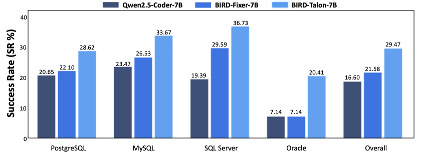

# BIRD-RL: Open-source Agentic RL Project for SQL Tasks 

This is the official github for **"From Imitation to Interactive Exploration: A Multi-Stage Reinforcement Learning Framework for Tool-Augmented SQL Agents"**

## ✨ Overview
**BIRD-RL** is an open-source framework for advancing autonomous SQL generation and debugging via **agentic reinforcement learning**. It introduces a novel **four-stage curriculum training paradigm** (Reasoning Imitation → Tool-Use Imitation → Reasoning Reinforcement → Interactive Agentic Reinforcement) to decouple grounded reasoning from tool interaction  and progressively develop these capabilities.

To enable efficient and stable training, BIRD-RL incorporates **trajectory-scoped persistent database sessions**, featuring stateful agent loops, thread-safe connection pooling with worker partitioning, and cross-tool state management. This design is specifically tailored to support high-concurrency, stateful database interactions.

As a result, BIRD-RL achieves stable policy learning in large search spaces and produces models that demonstrate strong performance on complex, real-world SQL tasks.

## ✨ Environment Setup

- Create conda environment and install VERL:

```bash
conda env create -f bird_rl.yaml
conda activate bird_rl
git clone https://github.com/volcengine/verl.git
cd verl
pip install --no-deps -e .
cd ..
```

- Apply the VERL patch (stateful tool agent loop):

```bash
VERL_PATH=$(python -c "import verl; print(verl.__path__[0])")
cp verl_patch/tool_agent_loop_with_db_cleanup.py $VERL_PATH/experimental/agent_loop/
```


## ✨ Data Preparation


- The **BIRD-CRITIC dataset** used in the paper can be directly download from  [BIRD-Critic-SQLite](https://huggingface.co/datasets/birdsql/bird-critic-1.0-sqlite), along with its train split [SIX-GYM-SQLite](https://huggingface.co/datasets/birdsql/six-gym-sqlite).

- The **BIRD mini-dev dataset** used in the paper can be directly downloaded from the [BIRD Leaderboard](https://bird-bench.github.io/). 

## ✨ Released Models: The BIRD-RL Collection

We introduce the [BIRD-RL Collection](https://huggingface.co/collections/birdsql/bird-rl), a suite of models meticulously trained to master the full SQL lifecycle.

| Model | Size | Description|
|---|---|---|
| [BIRD-Talon-7B](https://huggingface.co/birdsql/BIRD-Talon-7b) | 7B | SQL Debugging Specialist |
| [BIRD-Talon-14B](https://huggingface.co/birdsql/BIRD-Talon-14b) | 14B | SQL Debugging Specialist |
| [BIRD-Zeno-7B](https://huggingface.co/birdsql/bird-zeno-7b) | 7B | Unified Multi-task Model |

### 🚀 Model Highlights
- **BIRD-Talon Series**: These models are trained via a novel **four-stage curriculum training paradigm**, comprising Reasoning Imitation → Tool-calling Imitation → Reasoning Reinforcement → Interactive Agentic Reinforcement. They excel at identifying logical and syntax errors in SQL, transforming "failed" queries into executable queries that satisfies user intent.

- **BIRD-Zeno**: A unified multi-task model optimized via **principled data mixing estimation**. The targeted balancing sustains specialized debugging performance while delivering impressive performance in SQL generation tasks, demonstrating that joint optimization over the full SQL lifecycle yields synergistic gains without task interference.me

## ✨ Model Performance
### 🕊️ SQL Debugging Performance on BIRD-CRITIC-SQLite
  | Model | Quer. | Mana. | Pers. | **Overall** (SR%)|
  |---|---|---|---|---|
  | ***General-Purpose Models*** | | | | |
  | GPT-5.4-Pro | 44.01 | 38.67 | 39.72 | **42.00** |
  | Claude-Opus-4.6 | 50.35 | 44.00 | 39.01 | **46.20** |
  | Claude-Sonnet-4.5 | 46.83 | 36.00 | 34.75 | **41.80** |
  | Gemini-3.1-Pro | 53.52 | 44.00 | 41.84 | **48.80** |
  | GLM-4.7 | 48.24 | 40.00 | 33.33 | **42.80** |
  | Kimi-K2.5 | 46.48 | 37.33 | 35.46 | **42.00** |
  | MiniMax-M2-1 | 38.03 | 30.67 | 32.62 | **35.40** |
  | Qwen3-Coder-480B | 45.77 | 33.33 | 37.59 | **41.60** |
  | ***Multi-Turn Agents*** | | | | |
  | Claude-Opus-4.6 | 53.52 | 42.67 | 40.43 | **48.20** |
  | Claude-Sonnet-4.5 | 44.01 | 54.67 | 37.59 | **43.80** |
  | Qwen3-Coder-480B | 41.55 | 42.67 | 33.33 | **39.40** |
  | BIRD-FIXER-7B | 37.32 | 26.67 | 29.79 | **33.60** |
  | BIRD-FIXER-14B | 42.96 | 37.33 | 35.46 | **40.00** |
  | ***BIRD-RL Models (Ours)*** | | | | |
  | BIRD-Talon-7B | 46.13 | 45.33 | 40.43 | **44.40** |
  | BIRD-Talon-14B | 51.06 | 50.67 | 40.43 | **48.00** |
  | BIRD-Zeno-7B | 50.35 | 44.00 | 33.33 | **44.60** |

 Our BIRD-RL models achieve performance comparable to state-of-the-art general-purpose models (e.g., Gemini-3.1-Pro) and multi-turn agents backed
  by frontier LLMs (e.g., Claude-Opus-4.6), while requiring only 7B–14B parameters.

### 🕊️ SQL Generation Performance on BIRD
| Model | BIRD (EX%)| BIRD-Mini (EX%)|
  |---|---|---|
  | Multi-Turn-Agent-7B | 50.9 | 48.6 |
  | Reasoning-SQL-7B | **64.0** | -- |
  | SQL-R1-7B | 58.9 | -- |
  | OmniSQL-7B | 63.9 | -- |
  | SQL-TRAIL-7B | 60.1 | -- |
  | BIRD-Zeno-7B| 63.9 | 61.60 |

 As a unified model optimized via multi-task training, BIRD-Zeno-7B achieves competitive SQL generation performance on BIRD, comparable
  to specialized SQL generation models such as Reasoning-SQL-7B, while simultaneously maintaining strong SQL debugging
  capability.

### 🕊️ Performance on Multi-Dialect SQLs

<p align="center">
  
</p>

BIRD-Talon-7B demonstrates strong **cross-dialect generalization**, achieving significant improvements over baselines without any multi-dialect training data. The four-stage training pipeline teaches the model a general debugging strategy rather than memorizing dialect-specific syntax, enabling it to adapt based on environment feedback **without needing extra training**.

## ✨ Project Structure

```
BIRD-RL/
├── bird_rl/                        # Core library
│   ├── data/                       # Data preprocessing for all 4 stages
│   │   ├── generate_thought_prompts.py   # Stage 1: generate prompts for thought generation
│   │   ├── call_api.py                   # call LLM API with threading
│   │   ├── prepare_reasoning_sft_data.py # Stage 1: extract thoughts → SFT parquet
│   │   ├── generate_turn_prompts.py      # Stage 2: per-turn prompts with GT + history
│   │   ├── parse_turn_responses.py       # Stage 2: extract <thought> and <tool_call>
│   │   ├── execute_sql_observations.py   # Stage 2: execute SQL, collect observations
│   │   ├── build_trajectory.py           # Stage 2: accumulate multi-turn trajectories
│   │   ├── postprocess_trajectories.py   # Stage 2: extract SQL for validation
│   │   ├── prepare_multi_turn_sft_data.py# Stage 2: validated trajectories → SFT parquet
│   │   ├── prepare_reasoning_rl_data.py  # Stage 3: single-turn RL parquet (VERL format)
│   │   └── prepare_agentic_rl_data.py    # Stage 4: agentic RL parquet with tools_kwargs
│   │
│   ├── prompts/                    # Prompt templates
│   │   ├── critic_reasoning.py           # Single-turn: <thought> + <solution>
│   │   ├── critic_thought_generation.py  # Thought generation (with GT for data gen)
│   │   ├── sft_generation.py             # Multi-turn: tool-calling format (gen/train/validation)
│   │   ├── bird_generation.py            # BIRD benchmark prompts
│   │   ├── bird_sft_training.py          # BIRD SFT training prompts
│   │   └── hybrid_prompts.py             # Hybrid model prompts
│   │
│   ├── rewards/                    # Reward functions for VERL RL training
│   │   ├── critic_reward.py              # Single-turn critic reward (Stage 3)
│   │   ├── critic_reward_agentic.py      # Agentic critic reward (Stage 4)
│   │   ├── bird_reward.py                # BIRD single-turn reward
│   │   ├── bird_reward_agentic.py        # BIRD agentic reward
│   │   ├── hybrid_reward.py              # Hybrid single-turn reward
│   │   └── hybrid_reward_agentic.py      # Hybrid agentic reward
│   │
│   ├── tools/                      # Tool implementations for agentic RL
│   │   ├── critic_sql_executor.py        # execute_sql tool (critic)
│   │   ├── critic_submit_solution.py     # submit_solution tool (critic)
│   │   ├── bird_sql_executor.py          # execute_sql tool (BIRD)
│   │   ├── bird_submit_solution.py       # submit_solution tool (BIRD)
│   │   ├── hybrid_sql_executor.py        # execute_sql tool (hybrid)
│   │   ├── hybrid_submit_solution.py     # submit_solution tool (hybrid)
│   │   ├── pool_manager.py               # Database pool manager
│   │   └── sql_utils.py                  # Shared SQL utilities
│   │
│   ├── database/                   # Database connection and pooling
│   │   ├── config.py
│   │   ├── connection.py
│   │   └── pool.py
│   │
│   └── inference/                  # Inference pipelines
│       ├── vllm_infer.py                 # vLLM batch inference engine
│       ├── parse_responses.py            # Parse model responses
│       ├── execute_sql_observations.py   # Execute SQL during inference
│       ├── build_trajectory.py           # Build trajectories during inference
│       ├── critic/                       # Critic model inference
│       │   ├── generate_prompts.py
│       │   └── evaluate.py
│       └── bird/                         # BIRD benchmark inference
│           ├── generate_prompts.py
│           ├── generate_prompts_hybrid.py
│           └── evaluate.py
│
├── evaluation/                     # Evaluation code
│   ├── critic/                     # Critic evaluation (test-case based)
│   │   ├── run/run_eval.sh
│   │   └── src/
│   └── bird/                       # BIRD evaluation (official benchmark)
│       └── README.md               # → https://github.com/bird-bench/mini_dev
│
├── scripts/
│   ├── data/                       # Data preprocessing scripts
│   │   ├── stage1_generate_thought_prompts.sh
│   │   ├── stage1_call_api.sh
│   │   ├── stage1_prepare_sft_data.sh
│   │   ├── stage2_generate_trajectories.sh   # Multi-turn trajectory loop
│   │   ├── stage2_prepare_sft_data.sh        # Postprocess + create SFT parquet
│   │   ├── stage3_prepare_rl_data.sh
│   │   └── stage4_prepare_rl_data.sh
│   ├── train/                      # VERL training launch scripts
│   │   ├── stage1_reasoning_sft.sh
│   │   ├── stage2_multiturn_sft.sh
│   │   ├── stage3_reasoning_rl.sh
│   │   └── stage4_agentic_rl.sh
│   └── infer/                      # Inference scripts
│       ├── run_critic_inference.sh
│       ├── run_bird_inference.sh
│       └── run_hybrid_bird_inference.sh
│
└── verl_patch/                     # VERL framework patches
    └── tool_agent_loop_with_db_cleanup.py
```


